# Data model outline (ERD) — Sprint 0 (S0-08)

Status: For review (human gate "You review"). Scope: Phase-1 entities needed through Sprint 5 (tenancy, auth/RBAC, org structure, employee master, audit, workflow, documents). Payroll/leave/attendance entities are sketched only as future context and will be detailed in their sprints.

Conventions (from ADR-001 / ADR-006):
- Every tenant-owned table has non-null `tenant_id`. `tenant_id` is first in composite indexes and tenant-scoped unique constraints.
- `BelongsToTenant` global scope applies to all tenant-owned tables.
- 🔒 = field-level encrypted (envelope/KMS, ADR-006). 🔎 = has a blind-index column for exact-match lookup. (last4) = masked partial stored for display.
- Audit logs and attendance punches live in **MongoDB Atlas** (ADR-003), not MySQL — shown separately below.
- `tenants` is the only non-tenant-scoped (platform-level) table.

## Relational ERD (MySQL)

```mermaid
erDiagram
    TENANTS ||--o{ COMPANIES : has
    TENANTS ||--o{ USERS : has
    TENANTS ||--o{ EMPLOYEES : has
    TENANTS ||--o{ ROLES : has

    COMPANIES ||--o{ LOCATIONS : has
    COMPANIES ||--o{ DEPARTMENTS : has
    COMPANIES ||--o{ DESIGNATIONS : has
    COMPANIES ||--o{ GRADES : has

    USERS ||--o{ USER_ROLES : assigned
    ROLES ||--o{ USER_ROLES : assigned
    ROLES ||--o{ ROLE_PERMISSIONS : grants
    PERMISSIONS ||--o{ ROLE_PERMISSIONS : grantedBy
    USERS ||--o| MFA_CREDENTIALS : secures

    EMPLOYEES ||--o| USERS : "login account"
    EMPLOYEES }o--|| DEPARTMENTS : in
    EMPLOYEES }o--|| DESIGNATIONS : holds
    EMPLOYEES }o--|| GRADES : at
    EMPLOYEES }o--|| LOCATIONS : at
    EMPLOYEES }o--o| EMPLOYEES : "reports to"
    EMPLOYEES ||--o{ EMPLOYEE_CUSTOM_FIELD_VALUES : has
    CUSTOM_FIELD_DEFINITIONS ||--o{ EMPLOYEE_CUSTOM_FIELD_VALUES : defines
    EMPLOYEES ||--o{ EMPLOYEE_DOCUMENTS : owns

    WORKFLOW_DEFINITIONS ||--o{ WORKFLOW_INSTANCES : instantiates
    WORKFLOW_INSTANCES ||--o{ WORKFLOW_STEPS : has

    TENANTS {
        bigint id PK
        string name
        string subdomain UK "tenant resolved from subdomain"
        string db_connection "nullable; seam for future dedicated DB"
        string status
        timestamp created_at
    }
    COMPANIES {
        bigint id PK
        bigint tenant_id FK "index (tenant_id)"
        string legal_name
        string pan_company "optional, 🔒"
        timestamp created_at
    }
    LOCATIONS {
        bigint id PK
        bigint tenant_id FK
        bigint company_id FK
        string name
        string state "drives state-wise PT later"
    }
    DEPARTMENTS {
        bigint id PK
        bigint tenant_id FK
        bigint company_id FK
        string name
    }
    DESIGNATIONS {
        bigint id PK
        bigint tenant_id FK
        bigint company_id FK
        string title
    }
    GRADES {
        bigint id PK
        bigint tenant_id FK
        bigint company_id FK
        string name
    }
    USERS {
        bigint id PK
        bigint tenant_id FK "UNIQUE (tenant_id, email)"
        string email
        string password_hash
        bool mfa_enabled
        string status
        timestamp created_at
    }
    MFA_CREDENTIALS {
        bigint id PK
        bigint tenant_id FK
        bigint user_id FK
        string totp_secret "🔒"
        json recovery_codes "🔒"
    }
    ROLES {
        bigint id PK
        bigint tenant_id FK "UNIQUE (tenant_id, slug)"
        string name
        string slug
    }
    PERMISSIONS {
        bigint id PK
        string slug UK "platform-defined catalog"
        string description
    }
    ROLE_PERMISSIONS {
        bigint id PK
        bigint tenant_id FK
        bigint role_id FK
        bigint permission_id FK
    }
    USER_ROLES {
        bigint id PK
        bigint tenant_id FK
        bigint user_id FK
        bigint role_id FK
    }
    EMPLOYEES {
        bigint id PK
        bigint tenant_id FK "UNIQUE (tenant_id, employee_code)"
        bigint user_id FK "nullable login link"
        bigint company_id FK
        bigint department_id FK
        bigint designation_id FK
        bigint grade_id FK
        bigint location_id FK
        bigint manager_id FK "self ref"
        string full_name
        string work_email "UNIQUE (tenant_id, work_email)"
        string pan "🔒 🔎 blind index for lookup"
        string bank_account "🔒 (last4 shown)"
        string bank_ifsc "🔒"
        string status
        date date_of_joining
        timestamp created_at
    }
    CUSTOM_FIELD_DEFINITIONS {
        bigint id PK
        bigint tenant_id FK
        string entity "employee"
        string field_key
        string data_type
        json options
    }
    EMPLOYEE_CUSTOM_FIELD_VALUES {
        bigint id PK
        bigint tenant_id FK
        bigint employee_id FK
        bigint field_definition_id FK
        text value
    }
    EMPLOYEE_DOCUMENTS {
        bigint id PK
        bigint tenant_id FK
        bigint employee_id FK
        string type
        string s3_key "object in S3; presigned access"
        string filename
        timestamp uploaded_at
    }
    WORKFLOW_DEFINITIONS {
        bigint id PK
        bigint tenant_id FK
        string name
        string trigger_type
        json steps_config
    }
    WORKFLOW_INSTANCES {
        bigint id PK
        bigint tenant_id FK
        bigint definition_id FK
        string subject_type
        bigint subject_id
        string status
        timestamp created_at
    }
    WORKFLOW_STEPS {
        bigint id PK
        bigint tenant_id FK
        bigint instance_id FK
        int step_order
        bigint approver_user_id FK
        string status
        timestamp acted_at
    }
```

## Non-relational stores (MongoDB Atlas — ADR-003)

Not in the relational ERD; accessed only via `AuditLogStore` / `PunchStore` interfaces.

- **audit_logs**: `{ _id, tenant_id, actor_user_id, entity_type, entity_id, action, before, after, ip, occurred_at }`
  Indexes: `{tenant_id:1, occurred_at:-1}`, `{tenant_id:1, entity_type:1, entity_id:1, occurred_at:-1}`. Append-only; 7-yr retention policy.
- **punches** (Phase 2): `{ _id, tenant_id, employee_id, punched_at, source, geo, device_id }`
  Indexes: `{tenant_id:1, employee_id:1, punched_at:-1}`, `{tenant_id:1, punched_at:-1}`. 24-mo hot then S3 archive.

## Index strategy summary
- `tenant_id` first on every composite index and every tenant-scoped unique constraint (e.g. `(tenant_id, email)`, `(tenant_id, employee_code)`, `(tenant_id, work_email)`).
- Foreign-key lookups that are hot (e.g. employees by department, workflow steps by instance) get `(tenant_id, <fk>)` composite indexes to avoid full scans and support the p95 target (verified in S3-04).
- Blind-index column on `employees.pan` (keyed HMAC) for exact-match lookup without decrypting (ADR-006).

## Future entities (sketch only — detailed in their sprints)
Leave (types, policies, balances, requests — S7/S8), Attendance (shifts, rosters, regularizations — S9/S10; punches in Mongo), Payroll (salary components/structures, payroll runs, payslips, statutory outputs — S11-S16). All tenant-owned with the same `tenant_id`/index/encryption rules; salary amounts 🔒.

## Assumptions
- One `tenants` row per customer; multiple `companies` allowed under a tenant (mid-market groups with multiple legal entities).
- `permissions` is a platform-defined catalog (not tenant-owned); role→permission mapping is tenant-owned.
- Custom fields modeled as definition + value rows (EAV) for Phase 1; revisit if query load demands JSON columns.

## Open questions
- Multiple companies per tenant confirmed for mid-market (group structures)? Affects whether org entities hang off `tenant` or `company`.
- Final sensitive-field classification (which fields are 🔒 vs RBAC-only) — pending ADR-006 open question with compliance.
- Custom fields: EAV vs JSON column — acceptable to start with EAV?
