# Information Architecture — HRMS SaaS

Status: For review (planner). Mermaid IA diagram of the full product. Access to each branch is permission-gated (see NAVIGATION.md). Tenant is resolved from subdomain; the platform console sits outside the tenant model (pending scope decision).

```mermaid
flowchart TD
    subgraph UNAUTH["Unauthenticated"]
        LOGIN[Login] --> MFA[MFA verify]
        FP[Forgot password] --> RP[Reset password]
        ACT[Invite / Activate] --> MFASET[MFA setup]
    end

    LOGIN -->|session| ROOT

    ROOT{{Authenticated<br/>tenant = subdomain}}
    ROOT --> ADMINSHELL["(app) Admin / HR shell"]
    ROOT --> SELFSHELL["(self) Self-service shell"]
    ROOT -. pending scope .-> PLATFORM["(platform) Super Admin console"]

    %% Admin / HR
    ADMINSHELL --> DASH[Dashboard]
    ADMINSHELL --> ORG[Organization]
    ADMINSHELL --> EMP[Employees]
    ADMINSHELL --> ATT[Attendance]
    ADMINSHELL --> LV[Leave]
    ADMINSHELL --> PAY[Payroll]
    ADMINSHELL --> COMP[Compliance]
    ADMINSHELL --> DOC[Documents]
    ADMINSHELL --> WF[Workflows / Approvals]
    ADMINSHELL --> REP[Reports]
    ADMINSHELL --> NOTIF[Notifications]
    ADMINSHELL --> ADMIN[Administration]
    ADMINSHELL --> SET[Settings]
    ADMINSHELL --> AUD[Audit]

    ORG --> ORG1[Companies]
    ORG --> ORG2[Locations]
    ORG --> ORG3[Departments]
    ORG --> ORG4[Designations]
    ORG --> ORG5[Grades]
    ORG --> ORG6[Org & Reporting hierarchy]
    ORG --> ORG7[Holidays & Work calendars]

    EMP --> EMP1[All employees]
    EMP --> EMP2[Add employee]
    EMP --> EMP3[Onboarding]
    EMP --> EMP4[Transfers & changes]
    EMP --> EMP5[Exits]
    EMP1 --> EMPPROF[Employee profile<br/>19 tabs]

    ATT --> ATT1[Daily / Monthly]
    ATT --> ATT2[Regularizations]
    ATT --> ATT3[Shifts / Rosters]
    ATT --> ATT4[Policies / Reports]

    LV --> LV1[Apply / Balances]
    LV --> LV2[Approvals]
    LV --> LV3[Team calendar]
    LV --> LV4[Types / Policies]

    PAY --> PAY1[Components / Structures]
    PAY --> PAY2[Compensation]
    PAY --> PAY3[Runs - Draft→Publish]
    PAY --> PAY4[Payslips]
    PAY --> PAY5[Exceptions / Reports]

    COMP --> COMP1[PF / ESI / PT]
    COMP --> COMP2[TDS / Declarations]
    COMP --> COMP3[Gratuity / Bonus]
    COMP --> COMP4[Statutory reports & challans]

    DOC --> DOC1[Documents]
    DOC --> DOC2[Categories]
    DOC --> DOC3[Bulk upload]

    WF --> WF1[Definitions / Builder]
    WF --> WF2[Pending approvals]
    WF --> WF3[Instances]
    WF --> WF4[Delegation]

    REP --> REP1[Standard]
    REP --> REP2[Saved]
    REP --> REP3[Scheduled]
    REP --> REP4[Custom builder]

    ADMIN --> ADM1[Users]
    ADMIN --> ADM2[Roles & permissions]
    ADMIN --> ADM3[Invitations]
    ADMIN --> ADM4[Sessions & security]

    SET --> SET1[Tenant / Company / Branding]
    SET --> SET2[Localization]
    SET --> SET3[Notifications]
    SET --> SET4[Security / MFA / Sessions]
    SET --> SET5[Data retention - DPDP]
    SET --> SET6[Custom fields]

    %% Self-service
    SELFSHELL --> ME[My dashboard]
    SELFSHELL --> MEPROF[My profile]
    SELFSHELL --> MEATT[My attendance / punch]
    SELFSHELL --> MELV[My leave]
    SELFSHELL --> MEPAY[My payslips]
    SELFSHELL --> MEDOC[My documents]
    SELFSHELL --> MEREQ[My requests]
    SELFSHELL --> METAX[My tax declaration]
    SELFSHELL --> MENOT[My notifications / Announcements]
    SELFSHELL --> TEAM[Team - manager]
    TEAM --> TEAM1[Team members]
    TEAM --> TEAM2[Team attendance]
    TEAM --> TEAM3[Approvals]
    TEAM --> TEAM4[Team reports]

    %% Cross-cutting
    GS["Global search (Cmd/Ctrl+K)"] -. permission + tenant scoped .-> ADMINSHELL
```

Cross-cutting services feeding many branches: **Workflow engine** (leave, regularization, employee/salary changes, onboarding, exit, payroll approval), **Audit store** (every entity's history, MongoDB Atlas per ADR-003), **Notifications** (in-app/email/SMS), **Global search**, and the **permission layer** (`GET /auth/me`) gating every node.
